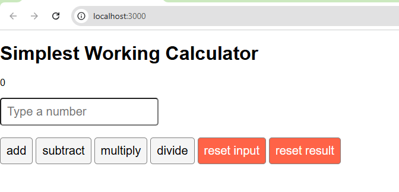

# Calculator Application

A functional calculator built with React featuring state management, event handling, and input validation.



## Project Overview

Built as part of the Meta React Specialization (Coursera, Jan 2026) to demonstrate React fundamentals and modern JavaScript practices.

**Status:** Completed

## Features

- Basic arithmetic operations (addition, subtraction, multiplication, division)
- Running total display with real-time updates
- Input validation with divide-by-zero error handling
- Separate reset functions for input and result
- Clean, responsive user interface

## Technologies

- React 19.2.3
- JavaScript (ES6+)
- CSS3
- React Hooks (useState, useRef)

## Installation

```bash
# Clone the repository
git clone https://github.com/Christina-C11/calculator-app.git
cd calculator-app

# Install dependencies
npm install

# Start the development server
npm start
```

Open [http://localhost:3000](http://localhost:3000) to view the app.

## Usage

1. Enter a number in the input field
2. Click an operation button (add, subtract, multiply, divide)
3. Enter another number and click another operation
4. The running total updates automatically
5. Use Reset Input to clear the current input
6. Use Reset Result to reset the total to zero

## Key Implementation

**State Management:**
- `useState` for managing the running total
- `useRef` for direct DOM element access

**Error Handling:**
- Divide-by-zero validation with user alerts
- Input field auto-focus after each operation

**Event Handling:**
- Prevented default form submission behavior
- Implemented separate handlers for each operation
